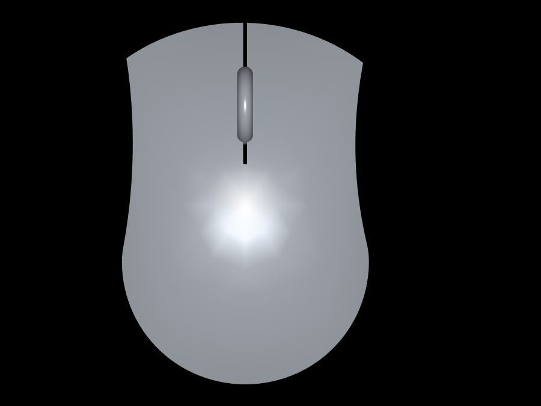

# key_sun


this is the image when you click the right button.

## The keyboard monitoring software for linux
this is a software to show the keyboard clicks on screen. it is useful when making a tutorial video so that learners know what you pressed.

[comment]: # ()

## how to install
first install the following dependancies on your system

### dependancies:

- SDL2-devel
- SDL2_image-devel
- gcc (only for compilation)
- make (only for compilation)

for void linux:

```
xbps-install SDL2-devel SDL2_image-devel make gcc
```

for debian-based linux:

```
apt install SDL2-dev SDL2_image-dev make gcc
```

after installing the dependancies, download the repository and `cd` into it and run this command to build from source:

```
make
```

if you want to remove the package run:

```
make clean
```

to run it:

```
./key_sun
```

## common issues:

- if it does not show the keys when you click that means you should change the `KEYBOARD_FILE` variable in the `key_sun.cpp` file. this is becouse the input file for your keyboard might be differant so check the event file in your `/dev/input/eventX' where X might be any number.
for example if you want to check `/dev/input/event2` then run `cat /dev/input/event2` then click any key on the keyboard if there is an output it means that this is the keyboard input file else try another file.
- if when you use `cat /dev/input/event0` you get authentication failed or something like that. then you have two options. first: run the program as root (not recommended) second: add yourself to the input group

## other project:
mouse_sun a mouse monitoring software 

## similar projects:
[key-mon](https://github.com/scottkirkwood/key-mon)
[KmCaster](https://github.com/johantiden/KmCaster)
